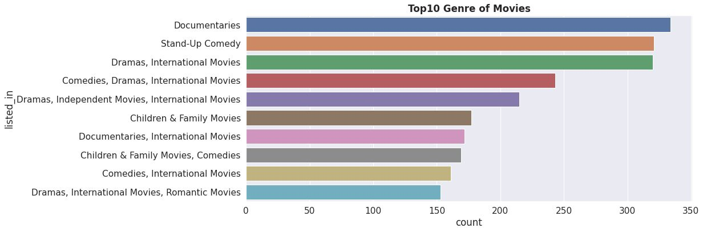
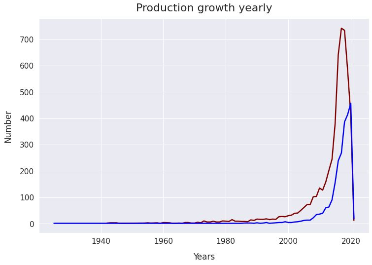
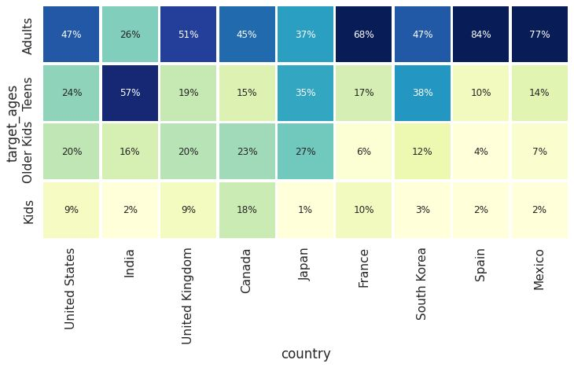

# Netflix Movies & TV Shows Clustering

## Project Overview
This project analyzes the Netflix Movies and TV Shows dataset to discover content trends, understand country-wise distribution, compare Movies vs TV Shows, and cluster similar content using Machine Learning techniques.

## Key Features
- Exploratory Data Analysis (EDA)
- Data Cleaning and Preprocessing
- Netflix Content Trend Analysis
- Country-wise Content Distribution
- Movies vs TV Shows Analysis
- Feature Engineering
- Text-Based Content Clustering
- Data Visualization

## Technologies Used
- Python
- Pandas
- NumPy
- Matplotlib
- Seaborn
- Scikit-learn
- Plotly
- Jupyter Notebook

## Project Workflow
1. Data Collection and Loading
2. Data Cleaning and Preprocessing
3. Exploratory Data Analysis (EDA)
4. Feature Engineering
5. Content Trend Analysis
6. Clustering Similar Netflix Content
7. Visualization and Insights

## Key Insights
- Analyzed Netflix content growth over the years.
- Compared the distribution of Movies and TV Shows.
- Identified top content-producing countries.
- Clustered similar content using machine learning techniques.
- Generated actionable insights through visual analytics.

## Top 10 Movie Genres

## Production Growth by Year

## Target Age vs Country Heatmap

